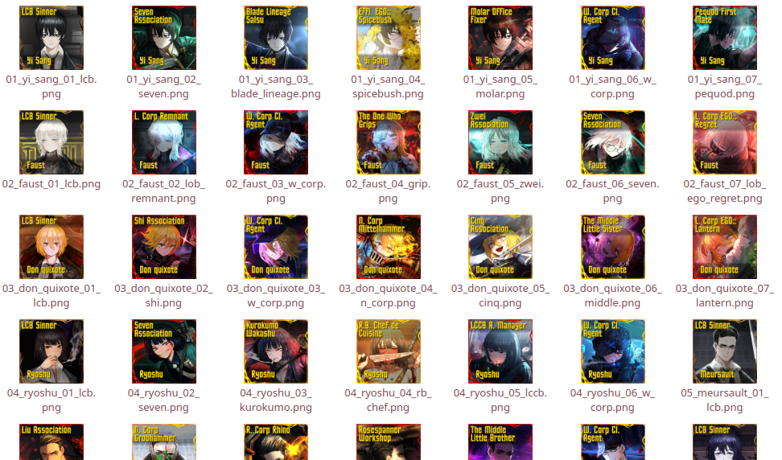

# Limbus Image

<p align="center">
    
</p>

> This odyssey had its purpose.

A CLI image generator to make Tier List style images of all the sinners. It
works relative to a `config.toml` file with folders for the assets (overlays),
inputs (sinner images in sub-directories), and outputs (sinner images but in a
flat directory).

If you're just here for a tier list website link, check out the [Tier Maker page](https://tiermaker.com/create/limbus-company-identities-16617387).

The images are stored in a specific directory structure relative to the TOML
file as follows:

```text
/
├── asset/
│   ├── gradient_small.png               # Overlay for 1 line of upper text
│   ├── gradient_large.png               # Overlay for 2 lines of upper text
│   ├── 0.png                            # 0 id border
│   ├── 00.png                           # 00 id border
│   └── 000.png                          # 000 id border
├── input/
│   └── [sinner_name]/
│       └── id/
│           └── [id_name].png            # Identity name matching the config
├── output/
│   └── id/
│       └── [sinner_name]_[id_name].png  # Output images
└── config.toml
```

Notably, sinners have an `id/` folder in the case that this project is expanded
to include EGOs. The output is flat to make copying easier as all of the images
are prefixed by the sinner and therefore do not need separate folders.

Images will be generated to have a different border based on their rarity and a
gradient behind the text is expanded for names with more than one line.

<div align="center">
    
</div>
<p align="center">Sinners of all rarities</p>

This was made because it seems the tier list maker website hasn't been updated
in a while.

If you see any errors, that's totally on me. I wrote this in like 8 hours when I
should have been sleeping. Make an issue or pull request if it bothers you.

## Installation

You can either install it via `cargo` or compile from the source.

### Installing from Cargo (Recommended)

To install it via Cargo from [crates.io](https://crates.io/), first ensure you
have Cargo installed. You can check with the version command:

```bash
cargo -V
```

If you need to install Cargo, look up a guide on your favorite search engine.
Once it's installed, just run the installation command:

```bash
cargo install
```

This is basically the same as compiling from the source, but more convenient.

The binary will be usable as `limbus-image` if Rust is correctly configured in
your path. Look it up if you have trouble or something.

### Building From the Source

To build from the source, clone the repo and run the cargo command:

```bash
cargo build --release
```

The binary will be created at `./target/release/limbus-image`. Use this path
when executing in **Usage** instead of `limbus-image`.

## Usage

### Config file

The binary requires a configuration [TOML](https://toml.io/en/) file in the
following format:

```toml
# Yi Sang is the first sinner by number, so he is first in the file

[[sinner]]
name = "Yi Sang" # Sinner name (for bottom text)
path = "yi_sang" # Path of folder
id = [
    { name = "LCB Sinner", rarity = 1, image = "lcb.png" },
    { name = "Seven Association", rarity = 2, image = "seven.png" },
    { name = "Blade Lineage Salsu", rarity = 3, image = "blade_lineage.png" },
    #                                           ^ Image file name
    #                               ^ Rarity (1 to 3)
    # ^ Sinner name (some are truncated to not go over 2 lines)
    ...
]
...
# Repeat for every sinner
```

The sinners and IDs should be in the order you wish the images to appear as the
outputted files have numbers to automatically order them. In the example, I have
ordered the sinners by sinner number and IDs by release order, rarity and then
preference for tie breakers.

The images are placed in relative directories to the config file, not from where
you execute the command from. The specific locations are explained at the top,
and but you can check out the `/test` directory to see what I have tested with.

### Generating the Images

After updating the `cargo.toml`, run the binary with a path to the config file.
Input and output directories are inferred based on the folder containing the
config.

If no location is given, the config will try to target `./config.toml`.

Assuming you just compiled the program and haven't installed it:

```bash
# Run on `./config.toml` (if it exists)
limbus-image

# Run on a specific config file
limbus-image ./test/config.toml
```

The images will be generated flat in the `./output/id/` directory. They have
numbers in the file names to be automatically sorted in sinner and then ID
release order when sorted alphabetically. This is helpful for tools like Tier
Maker which sort all uploaded images in alphabetical order automatically.

The format is as follows:

```text
[sinner_number]_[sinner_name]_[id_number]_[id_name].png
```

They will look something like this:

<p align="center">
    
</p>

## Limitations

Images are hard coded to be 600 by 600 as font sizes are kind of strange and I
don't want to deal with them. I don't have high resolution overlays and the
provided images are at a lower resolution so it's not very useful to go past
600 pixels.

## Contributing

Feel free to add issues or make pull requests regarding new IDs. Remember that
the binary needs to be run on the config file in `./test/config.toml` to update
the repository's images.

## Disclaimer

This project is unaffiliated with Limbus Company's creators/distributors. Images
have been taken from the **Organized Limbus Company Files** from the
[ProjectMoon Community Hub](https://discord.gg/pmooncommunityfanhub) Discord
server.

## License

[MIT](https://choosealicense.com/licenses/mit/)
